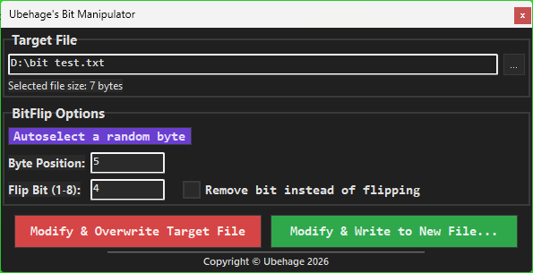

# Ubehage's Bit Manipulator (Work-in-progress)

A small and portable program for flipping or removing a single bit anywhere in a file.
This is a re-upload. The first attempt got screwed up, for some reason.
I have fixed the design issues.

## This program is under construction.
What works so far:
- The UI is fully functional.
- Manipulating a bit in a selected file is fully implemented.

What doesn't work yet:
- Copying data to a new file and leaving the original untouched.
- No error handling implemented. If a job fails due to write errors or other, it will report job done.

## Screenshot

## Safety notice
- The features that do work has not been thoroughly tested.
- Use at your own risk.
- Remember to take backup of important data.

## License
Copyright © Ubehage 2026.

MIT License. All code is free to use and modify.

